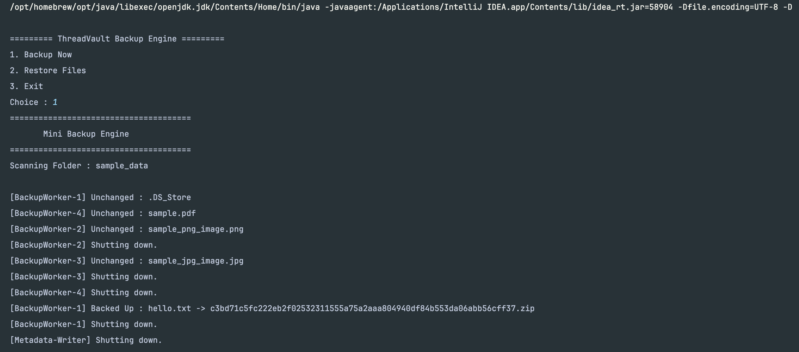
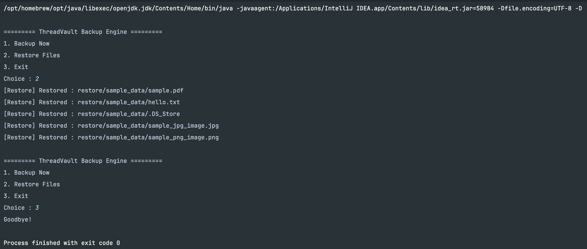

# ThreadVault 🚀

# Concurrent Incremental Backup & Deduplication Engine

ThreadVault is a high-performance backup engine built in **Java** that demonstrates how modern backup systems handle large-scale file protection using:

- Multithreading
- Producer-Consumer architecture
- Incremental backups
- Content-based deduplication
- Compression
- Metadata indexing
- Background scheduling
- File system monitoring

The project is inspired by concepts used in enterprise backup platforms such as **Rubrik** and other modern data protection systems.

---

# 📌 Problem Statement

Traditional backup systems repeatedly process unchanged files.

Example:

### First Backup

```
photo.jpg
document.pdf
video.mp4
```

Everything is processed:

- Files are scanned
- Hashes are calculated
- Data is compressed
- Backup copies are created

### Second Backup

```
photo.jpg
document.pdf
video.mp4
```

A naive backup system will again:

- Read every file
- Calculate hashes
- Compress everything
- Store duplicate data

This wastes:

- CPU
- Disk space
- Processing time

---

ThreadVault solves this problem by intelligently detecting unchanged files and only processing modified content.

---

# 🚀 Key Features

## 1. Multi-threaded Backup Pipeline

ThreadVault follows a **Producer-Consumer architecture**:

```
                 Directory Scanner
                       |
                       ↓
              BlockingQueue<FileTask>
                       |
                       ↓
              Backup Worker Threads
                       |
                       ↓
        Hashing → Deduplication → Compression
                       |
                       ↓
              Metadata Storage
```

### Benefits

- Parallel file processing
- Better CPU utilization
- Controlled memory usage
- Thread-safe operations
- Scalable backup workflow

---

# 2. Incremental Backup

Before performing expensive operations like SHA-256 hashing, ThreadVault checks existing metadata.

The comparison uses:

```
File Path
    +
File Size
    +
Last Modified Time
```

Flow:

```
File Detected

      |
      ↓

Check Previous Metadata

      |
      +----------------+
      |                |
      ↓                ↓

Unchanged          Modified

      |                |
      ↓                ↓

Skip Backup      Process File
```

This avoids unnecessary:

- Hash calculations
- Compression
- Disk writes

---

# 3. Content-Based Deduplication

ThreadVault identifies duplicate files using **SHA-256 hashing**.

Example:

```
file1.jpg

SHA-256:
abc123


file2.jpg

SHA-256:
abc123
```

Since both files have the same hash:

```
file2.jpg → Duplicate
```

The backup engine avoids storing duplicate compressed copies.

---

# 4. Compression Engine

Files are compressed before storage.

Backup pipeline:

```
Original File

      ↓

SHA-256 Hash Calculation

      ↓

Duplicate Check

      ↓

ZIP Compression

      ↓

Backup Storage
```

Example storage:

```
backup_storage/

├── abc123456.zip
├── xyz987654.zip
└── pqr555888.zip
```

Files are stored using their content hash.

---

# 5. Metadata Management

ThreadVault maintains a metadata catalog containing:

```
Original Path

File Hash

Backup Location

Original Size

Compressed Size

Backup Time

Last Modified Time
```

Metadata is persisted as:

```
metadata/

└── metadata.json
```

The metadata index enables:

- Fast incremental checks
- Duplicate detection
- Restore operations
- Backup tracking

---

# 6. Restore System

Restore is completely metadata-driven.

Restore flow:

```
metadata.json

      ↓

Find Backup Location

      ↓

Locate ZIP Archive

      ↓

Extract File

      ↓

Restore Original Path
```

Restored files are placed inside:

```
restore/
```

---

# 🏗 Architecture

High-level system architecture:

```
                         Main

                          |

                          ↓

                       BackupCLI

                          |

              +-----------+-----------+

              |                       |

              ↓                       ↓

       BackupManager           RestoreManager

              |

              ↓

       DirectoryScanner

              |

              ↓

       BlockingQueue<FileTask>

              |

              ↓

        Backup Worker Pool

              |

              ↓

       Incremental Engine

              |

              ↓

      SHA-256 Hash Calculator

              |

              ↓

      Deduplication Engine

              |

              ↓

       Compression Engine

              |

              ↓

       Metadata Writer

              |

              ↓

       Metadata Store
```

---

# 🧵 Multithreading Design

ThreadVault uses Java concurrency utilities.

## ExecutorService

A fixed thread pool processes backup tasks.

Example:

```
Worker-1

Worker-2

Worker-3

Worker-4
```

Each worker independently performs:

1. Receives a file task
2. Checks incremental status
3. Calculates SHA-256 hash
4. Checks duplicates
5. Compresses file
6. Updates metadata

---

# 🔒 Thread Safety

Thread-safe components:

## BlockingQueue

Used for communication between:

```
Directory Scanner

        ↓

Backup Workers
```

and:

```
Backup Workers

        ↓

Metadata Writer
```

---

## ConcurrentHashMap

Used for:

- Metadata indexing
- Hash lookup
- Deduplication tracking

---

## Atomic Counters

Backup statistics use:

- AtomicInteger
- LongAdder

for thread-safe reporting.

---

# ⚙️ Configuration

Configuration file:

```
src/main/resources/config.properties
```

Example:

```properties
workers=4

backup.directory=sample_data

watch.mode=false
```

Configuration controls:

- Worker thread count
- Backup directory
- File watcher mode

---

# 📂 Project Structure

```
src/main/java

├── backup
│   ├── BackupManager
│   └── BackupWorker
│
├── scanner
│   ├── DirectoryScanner
│   └── FileTask
│
├── dedup
│   ├── DeduplicationEngine
│   └── HashCalculator
│
├── compression
│   └── CompressionManager
│
├── incremental
│   └── IncrementalBackupEngine
│
├── metadata
│   ├── MetadataStore
│   ├── MetadataWriter
│   └── FileMetadata
│
├── restore
│   └── RestoreManager
│
├── scheduler
│   └── BackupScheduler
│
├── watcher
│   └── DirectoryWatcher
│
├── stats
│   └── BackupStatistics
│
├── config
│   └── AppConfig
│
└── cli
    └── BackupCLI
```

---

# 🛠 Tech Stack

## Language

- Java 25

## Build Tool

- Maven

## Libraries

- Jackson JSON
- Java NIO
- Java Concurrency API


---

# ▶️ Running the Project

## Clone Repository

```bash
git clone <repository-url>
```

## Build

```bash
mvn clean package
```

## Run

```bash
java -jar target/ThreadVault.jar
```

---

# 🖥 Example Output






---


ThreadVault demonstrates how a production-style backup system can be designed using:

- Efficient algorithms
- Concurrent programming
- Metadata-driven architecture
- Storage optimization techniques

The project focuses on engineering principles used in real-world data protection systems.
